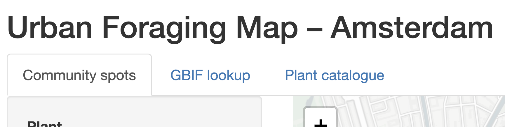
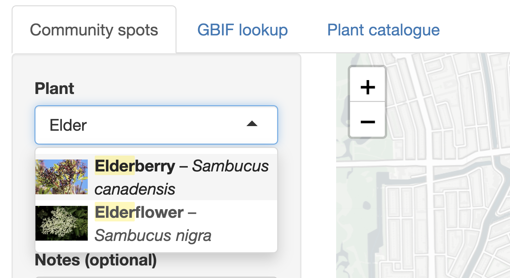
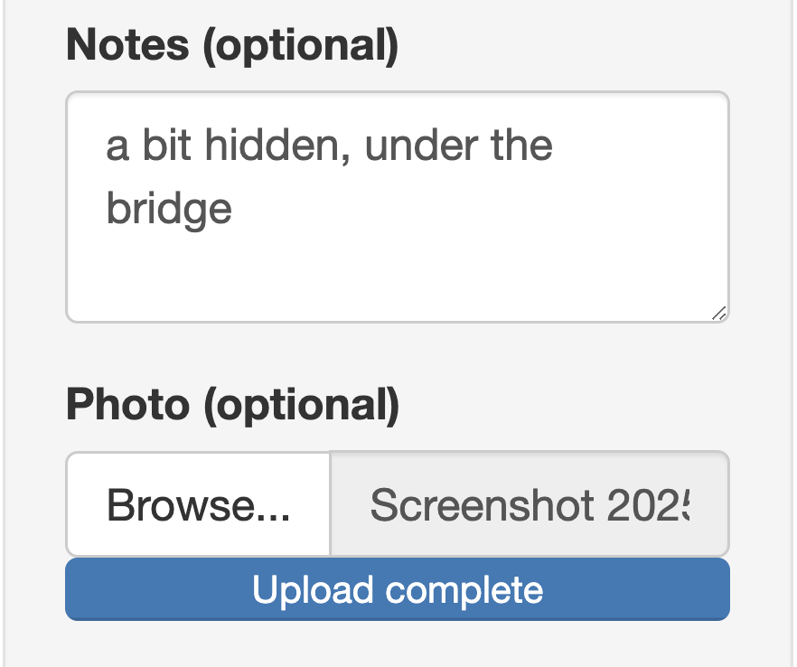
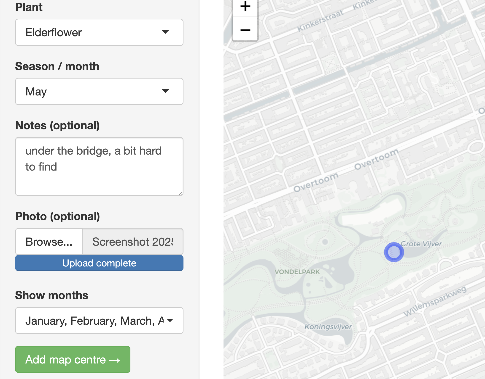
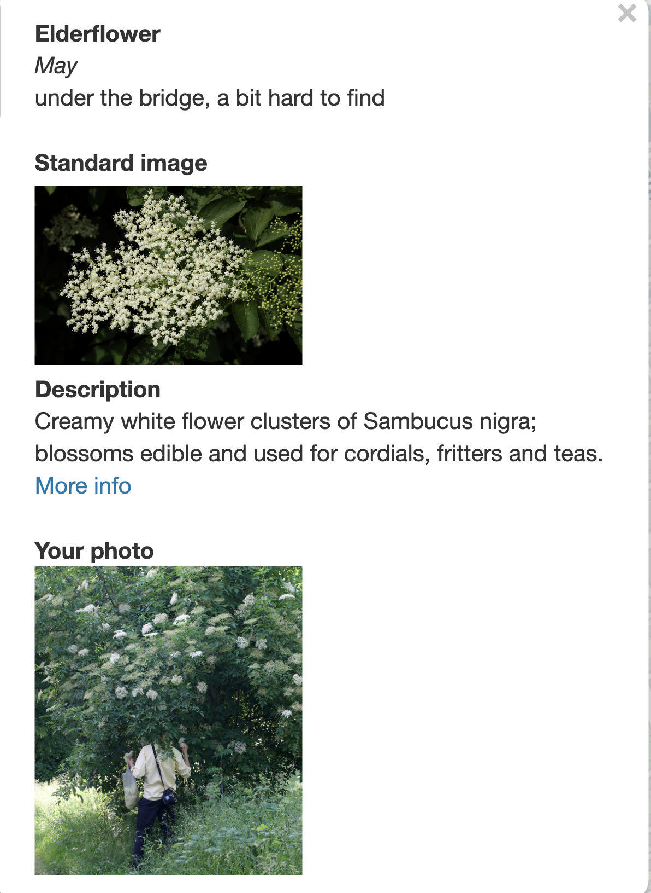
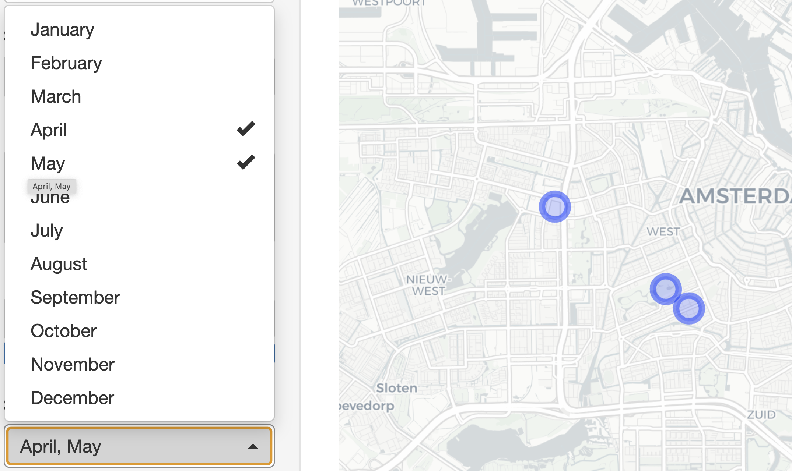
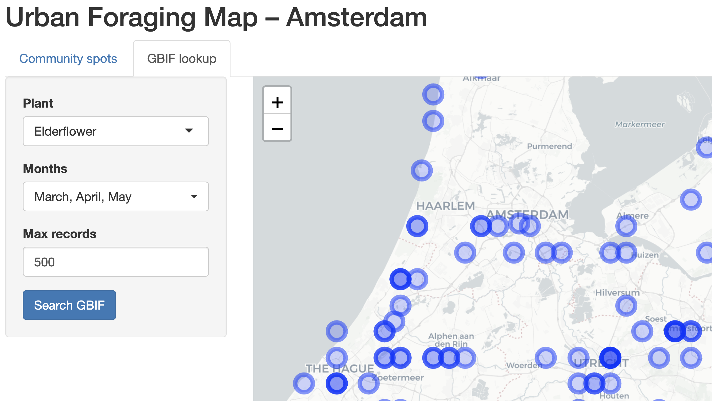
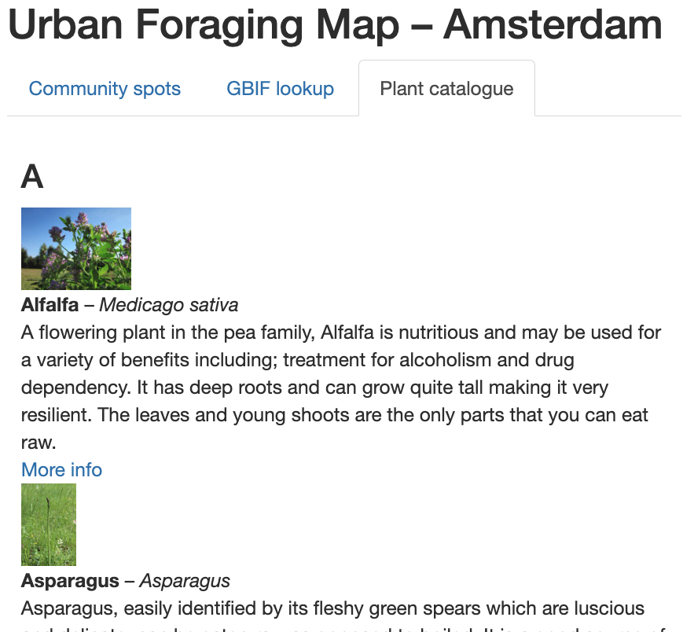

```{r setup, include = FALSE}
knitr::opts_chunk$set(
  collapse = TRUE,
  comment = "#>"
)
```

# Abstract

The Urban Foraging Map is an R Shiny application that allows users to explore and contribute to a map of edible wild plants in Amsterdam. It combines **user-submitted data**, **real-time biodiversity records** from Global Biodiversity Information Facility (GBIF), and a **scrollable catalogue** of edible wild plants with information on identification, harvesting, preparation, and safety considerations.


# 1. Introduction

This project was inspired by my long bike rides to and from the Roeterseiland campus, where I kept spotting elderflower blooming everywhere in May. One day, I decided to pick some and ended up making elderflower syrup— which was incredibly satisfying and super delicious. That got me thinking: how cool would it be to have a simple app where people could share these kinds of hidden foraging spots and also learn more about edible wild plants along the way? This Shiny app is my way of making that idea real. It helps people find, identify, and share edible wild plants around the city.

---
# 2. Installation and Launching

## 2.1 Installation

```r
remotes::install_github("Programming-The-Next-Step-2025/UrbanForaging")
```

## 2.2 Launching the App

```r
urbanforaging::run_uf_app()
```

# 3. Functional Overview

## 3.1 Tab 1: Community Spots

* **Select a plant** using a searchable dropdown with images
* **Submit a new foraging spot** by panning to a map location
* **Add notes and photos** optionally
* **View all contributions** filtered by season/month

## 3.2 Tab 2: GBIF Lookup

* **Choose a plant by scientific or common name**
* **Filter real GBIF observations by month**
* **Set a record limit** for performance
* **Plot results** on a separate leaflet map

## 3.3 Tab 3: Plant Catalogue

* **Browse all included plants** alphabetically
* **View image, common/scientific name, description (e.g.,identification, harvesting), and wikipedia link**

# 4. User Guide

## 4.1 Tab 1 – Community Spots

### Scenario 1: You found an edible plant (e.g., elderflower) at a foraging spot and want to add it to the map

1. Navigate to **Community Spots** tab. 
  
```{r comm-tab, echo = FALSE, out.width='90%', fig.cap="Navigate to the Community Spots tab", fig.pos='H'}

```

2. Look up the plant by typing its name and selecting it. Common and Latin names are shown.  

```{r comm-select, echo = FALSE, out.width='90%', fig.cap="Plant selection dropdown with images", fig.pos='H'}

```

3. Select the season/month. Optionally, add notes and a photo.  
```{r comm-photo, echo = FALSE, out.width='90%', fig.cap="Add notes and optional photo", fig.pos='H'}

```

4. Click **Add map centre**.  
```{r comm-add, echo = FALSE, out.width='90%', fig.cap="Add map centre", fig.pos='H'}

```

5. The spot is now added. Clicking the marker reveals your photo, description, and plant info (with Wikipedia link). 
```{r comm-view, echo = FALSE, out.width='90%', fig.cap="View the added entry", fig.pos='H'}

```

### Scenario 2: Browse community entries by month

Select a season under "Show months" to filter existing foraging entries.  
You'll see other users' contributions for that month near your location. 

```{r comm-filter, echo = FALSE, out.width='90%', fig.cap="Filter spots by month", fig.pos='H'}

```

## 4.2 Tab 2 – GBIF Lookup

### Scenario: There are no community entries for your plant of interest?

You can still explore seasonal data via GBIF:

1. Select the plant by typing its name.  
2. Choose one or more months to filter by season.  
3. Set a max record limit (default = 500).  
4. View observations from GBIF on the map. 

```{r gbif, echo = FALSE, out.width='90%', fig.cap="GBIF search and results", fig.pos='H'}

```

## 4.3 Tab 3 – Plant Catalogue

### Scenario: You want to learn more about a specific plant or explore out of curiosity

Use the scrollable catalogue to browse all included plants.  
Each entry includes name, image, description, and source links. 

```{r catalogue, echo = FALSE, out.width='90%', fig.cap="Plant catalogue overview", fig.pos='H'}

```

# 5. Package Architecture

## Data Structure

* `plants_df`: cleaned `edible_plants.csv` based on kaggle data set
* `spots_rv`: reactive value holding `foraging_spots.csv`


## File Structure

* `save_spots()` – Saves new entries to the CSV file and updates the reactive value within the Shiny app
* `add_foraging_location()` - helper function used internally for `save_spots()`, can also be used from the R console to add foraging spots programmatically
* `get_gbif_occurrences_by_month()` – Fetches filtered GBIF occurrence data based on selected scientific name, months, and record limit. Uses the GBIF API to retrieve real-time biodiversity data
 

## Key Functions

- `save_spots()`: saves data to CSV  
- `add_foraging_location()`: helper for programmatic spot addition  
- `get_gbif_occurrences_by_month()`: fetches GBIF data from API  

## Error Handling

* If a photo upload fails: shows fallback image
* If GBIF returns no data: displays a message instead of crashing
* If CSV is missing: app creates it on first run

## Packages Used

- `shiny`, `leaflet`, `dplyr`, `readr`, `purrr`, `htmltools`, `shinyWidgets`, `rprojroot`

# 6. Conclusion

Urban Foraging combines open plant data and community input into an interactive map that guides users in foraging wild plants. It’s a tool for curious beginners and foraging enthusiasts alike.


# 7. References

- [GBIF.org](https://www.gbif.org/)  
- [Wikipedia](https://www.wikipedia.org/)  
- [Wikimedia Commons](https://commons.wikimedia.org/)  
- [Kaggle – Edible Wild Plants](https://www.kaggle.com/datasets/gverzea/edible-wild-plants)  
- [Mastering Shiny](https://mastering-shiny.org)
